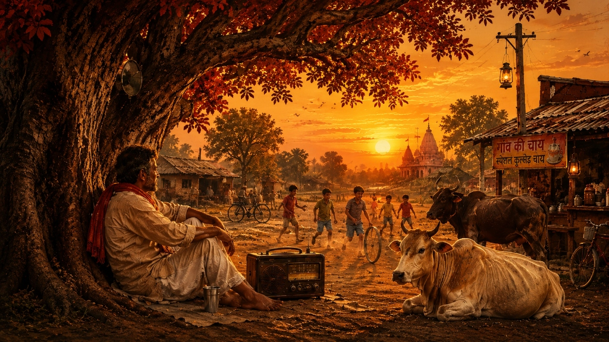

# ☕ NOSTALGIA

> **A nostalgic Indian music listening website with a vintage chai-stall atmosphere.**

[](https://react.dev/)
[](https://www.typescriptlang.org/)
[](https://vitejs.dev/)
[](https://tailwindcss.com/)
[](https://pages.cloudflare.com/)
[](LICENSE)

---

## 🌐 Live Demo

🔗 **Explore Nostalgia Live:** https://nostalgia-cek.pages.dev/
*(Replace with your deployed Cloudflare Pages URL)*

---

## 📸 Preview

<div align="center">
  
</div>

<p align="center">
  <em>Immerse yourself in warm retro vibes, steaming cutting chai, and evergreen melodies.</em>
</p>

---

## ✨ Features

- 🎵 **YouTube Music Playback** — Seamless streaming and audio synchronization powered by the YouTube IFrame API.
- 📻 **Playlist-Based Music Library** — Curated retro and classic collections tailored for work, study, and relaxed evenings.
- ❤️ **Favourite Songs** — Save and manage your favorite tracks with instant local persistence.
- 🎛️ **Full Music Player Controls** — Play, pause, skip, track scrubbing, shuffle, repeat, and volume management.
- 🌙 **Night Mode** — Switch to a cozy midnight scene with warm lantern glows and twilight scenery.
- 🌧️ **Rain Mode with Ambient Effects** — Toggle relaxing rain sounds and dynamic raindrop animations over the tea-stall backdrop.
- 📱 **Responsive Mobile Design** — Fully optimized touch-friendly interface across smartphones, tablets, and desktops.
- 💾 **Persistent Player State** — Automatically saves volume settings, favorites, and playback preferences across sessions.

---

## 🛠️ Tech Stack

| Technology | Role |
| :--- | :--- |
| **[React 19](https://react.dev/)** | Component-driven UI architecture |
| **[TypeScript](https://www.typescriptlang.org/)** | Type-safe code and developer ergonomics |
| **[Vite](https://vitejs.dev/)** | Ultra-fast local development and bundling |
| **[Tailwind CSS v4](https://tailwindcss.com/)** | Custom utility styling and responsive layouts |
| **[YouTube IFrame API](https://developers.google.com/youtube/iframe_api_reference)** | Background music and media playback engine |
| **[Lucide React](https://lucide.dev/)** | Crisp, lightweight icons |

---

## 📁 Project Structure

```text
nostalgia/
├── public/                  # Static assets & public media
│   ├── audio/               # Ambient sounds (rain, background audio)
│   ├── images/              # Song artwork & thumbnails
│   ├── hero-bg.png          # Daytime vintage stall scene artwork
│   ├── hero-night-bg.png    # Nighttime atmospheric artwork
│   └── favicon.svg          # Favicon and site icons
├── src/
│   ├── assets/              # Icons and vector graphics
│   ├── components/          # Reusable UI & media components
│   │   ├── MusicPlayer.tsx  # Interactive music player & controls
│   │   ├── RainOverlay.tsx  # Rain animation & ambient audio engine
│   │   ├── ModeSelector.tsx # Day/Night and mode controls
│   │   └── ...
│   ├── context/             # Global application state
│   │   ├── MusicPlayerContext.tsx # Audio playback state & YouTube player
│   │   └── SceneModeContext.tsx   # Day/Night/Rain scene modes
│   ├── data/                # Song tracks and playlist configurations
│   │   ├── playlists.ts     # Curated playlists
│   │   └── songs.ts         # Song database & YouTube IDs
│   ├── hooks/               # Custom React hooks (e.g., useFavourites, useParallax)
│   ├── pages/               # Top-level view routes (Home, Playlists, About, Contact)
│   ├── App.tsx              # Root application layout
│   ├── index.css            # Tailwind CSS and global style directives
│   └── main.tsx             # React DOM entry point
├── index.html               # Main HTML entry document
├── package.json             # Dependencies and build scripts
├── tailwind.config.js       # Tailwind CSS configuration
├── tsconfig.json            # TypeScript configuration
└── vite.config.ts           # Vite configuration
```

---

## 🚀 Getting Started

### Prerequisites

Ensure you have [Node.js](https://nodejs.org/) (version `18.0.0` or higher recommended) and `npm` installed.

### 1. Clone the Repository

```bash
git clone https://github.com/your-username/nostalgia.git
cd nostalgia
```

### 2. Install Dependencies

```bash
npm install
```

### 3. Start Development Server

Run the local development server:

```bash
npm run dev
```

Open your browser and navigate to `http://localhost:5173` to view the application.

---

## 📦 Production Build

To build the project for production deployment:

```bash
npm run build
```

This compiles TypeScript definitions and creates an optimized static build in the `dist/` directory.

To preview the production build locally:

```bash
npm run preview
```

---

## ☁️ Deployment (Cloudflare Pages)

This project is optimized for deployment on **Cloudflare Pages**:

### Option A: Git Integration (Recommended)
1. Push your code to a GitHub or GitLab repository.
2. In the **Cloudflare Dashboard**, navigate to **Workers & Pages** > **Create application** > **Pages** > **Connect to Git**.
3. Select your `nostalgia` repository.
4. Configure the build settings:
   - **Framework preset:** `Vite`
   - **Build command:** `npm run build`
   - **Build output directory:** `dist`
   - **Root directory:** `/` (leave default)
5. Click **Save and Deploy**.

### Option B: Cloudflare Wrangler CLI
```bash
# Build the project
npm run build

# Deploy via Wrangler
npx wrangler pages deploy dist --project-name=nostalgia
```

---

## 📜 Credits & Acknowledgments

- **Inspiration:** The timeless atmosphere of Indian street chai stalls, old radios, and soulful melodies.
- **Audio & Media:** YouTube content creators and legendary artists whose music powers the nostalgic experience.
- **Icons:** [Lucide Icons](https://lucide.dev/)

---

